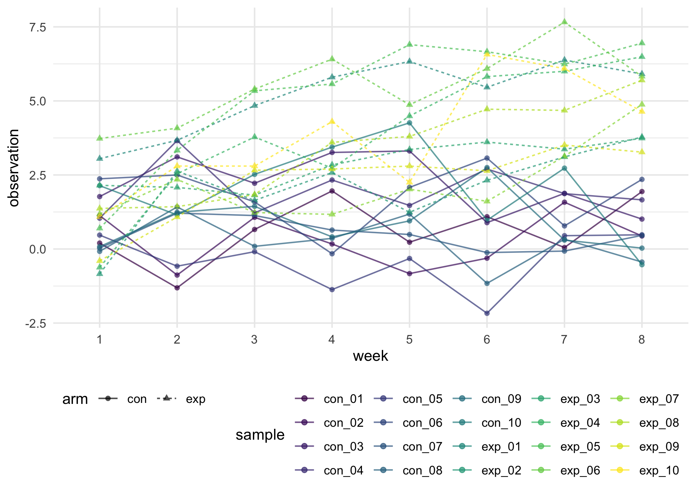
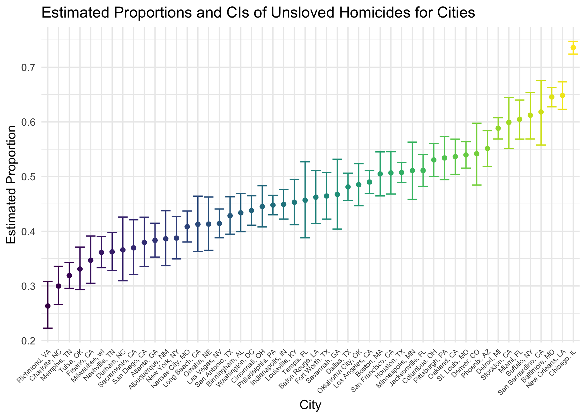

p8105_hw5_tl3196
================
Tianshu Liu

## Problem 1

Import and tidy data from csv files.

``` r
# generate file list
file_path = "./data/con_exp_data/"
file_list = list.files(path = file_path, full.names = FALSE)

# import and tidy data
con_exp_df =
  expand_grid(
    sample = file_list
  ) %>% 
  mutate(
    data = purrr::map(
      .x = file_list, 
      ~read_csv(file = str_c(file_path, .x))),
    sample = str_sub(sample, end = -5)
  ) %>% 
   separate(
     col = sample, sep = '_', 
     into = c("arm", "id"),
     remove = FALSE
  ) %>% 
  unnest(data) %>% 
  pivot_longer(
    cols = week_1:week_8,
    names_to = "week",
    names_prefix = "week_",
    values_to = "observation"
  )

con_exp_df
```

    ## # A tibble: 160 × 5
    ##    sample arm   id    week  observation
    ##    <chr>  <chr> <chr> <chr>       <dbl>
    ##  1 con_01 con   01    1            0.2 
    ##  2 con_01 con   01    2           -1.31
    ##  3 con_01 con   01    3            0.66
    ##  4 con_01 con   01    4            1.96
    ##  5 con_01 con   01    5            0.23
    ##  6 con_01 con   01    6            1.09
    ##  7 con_01 con   01    7            0.05
    ##  8 con_01 con   01    8            1.94
    ##  9 con_02 con   02    1            1.13
    ## 10 con_02 con   02    2           -0.88
    ## # … with 150 more rows

Make a spaghetti plot for the tidy data.

``` r
# spaghetti plot
con_exp_df %>% 
  ggplot(aes(x = week, y = observation, group = sample, color = sample)) + 
  geom_point(aes(shape = arm), alpha = .7) + 
  geom_line(aes(linetype = arm), alpha = .7)
```



From the plot, we can identify that there are not significant difference
between participants in the two arms at the beginning of the study.
Participants in the experimental arm have significant increasing trend
on observations, while participants in the control arm almost remain the
same as the beginning. With this trend, the difference between the two
arms becomes more and more significant. From the 7th week, all
participants in the experimental arm have higher observation than all
participants in the control arm. Therefore, compared to the control arm,
the experimental arm has significant increase in observations.

## Problem 2

Import data from `homicide-data.csv`.

``` r
homicide_df = read_csv("./data/homicide-data.csv")
homicide_df
```

    ## # A tibble: 52,179 × 12
    ##    uid   repor…¹ victi…² victi…³ victi…⁴ victi…⁵ victi…⁶ city  state   lat   lon
    ##    <chr>   <dbl> <chr>   <chr>   <chr>   <chr>   <chr>   <chr> <chr> <dbl> <dbl>
    ##  1 Alb-…  2.01e7 GARCIA  JUAN    Hispan… 78      Male    Albu… NM     35.1 -107.
    ##  2 Alb-…  2.01e7 MONTOYA CAMERON Hispan… 17      Male    Albu… NM     35.1 -107.
    ##  3 Alb-…  2.01e7 SATTER… VIVIANA White   15      Female  Albu… NM     35.1 -107.
    ##  4 Alb-…  2.01e7 MENDIO… CARLOS  Hispan… 32      Male    Albu… NM     35.1 -107.
    ##  5 Alb-…  2.01e7 MULA    VIVIAN  White   72      Female  Albu… NM     35.1 -107.
    ##  6 Alb-…  2.01e7 BOOK    GERALD… White   91      Female  Albu… NM     35.2 -107.
    ##  7 Alb-…  2.01e7 MALDON… DAVID   Hispan… 52      Male    Albu… NM     35.1 -107.
    ##  8 Alb-…  2.01e7 MALDON… CONNIE  Hispan… 52      Female  Albu… NM     35.1 -107.
    ##  9 Alb-…  2.01e7 MARTIN… GUSTAVO White   56      Male    Albu… NM     35.1 -107.
    ## 10 Alb-…  2.01e7 HERRERA ISRAEL  Hispan… 43      Male    Albu… NM     35.1 -107.
    ## # … with 52,169 more rows, 1 more variable: disposition <chr>, and abbreviated
    ## #   variable names ¹​reported_date, ²​victim_last, ³​victim_first, ⁴​victim_race,
    ## #   ⁵​victim_age, ⁶​victim_sex

The raw homicide dataset collected by the Washington Post covers `52179`
homicide cases in 50 large U.S. cities. Each homicide case is described
by `12` variables, including
`uid, reported_date, victim_last, victim_first, victim_race, victim_age, victim_sex, city, state, lat, lon, disposition`.
The variables are shown in the table below.

| col_names     | col_types | description                           |
|:--------------|:----------|:--------------------------------------|
| uid           | character | case id                               |
| reported_date | numeric   | date of the homicide being reported   |
| victim_last   | character | last name of the victim               |
| victim_first  | character | first name of the victim              |
| victim_race   | character | race of the victim                    |
| victim_age    | character | age of the victim                     |
| victim_sex    | character | gender of the victim                  |
| city          | character | city of the homicide                  |
| state         | character | state of the homicide                 |
| lat           | numeric   | latitude of the homicide’s location   |
| lon           | numeric   | longtitude of the homicide’s location |
| disposition   | character | current arresting condition           |

``` r
homicide_df = 
  homicide_df %>% mutate(city_state = str_c(city, ", ", state))

homicide_df
```

    ## # A tibble: 52,179 × 13
    ##    uid   repor…¹ victi…² victi…³ victi…⁴ victi…⁵ victi…⁶ city  state   lat   lon
    ##    <chr>   <dbl> <chr>   <chr>   <chr>   <chr>   <chr>   <chr> <chr> <dbl> <dbl>
    ##  1 Alb-…  2.01e7 GARCIA  JUAN    Hispan… 78      Male    Albu… NM     35.1 -107.
    ##  2 Alb-…  2.01e7 MONTOYA CAMERON Hispan… 17      Male    Albu… NM     35.1 -107.
    ##  3 Alb-…  2.01e7 SATTER… VIVIANA White   15      Female  Albu… NM     35.1 -107.
    ##  4 Alb-…  2.01e7 MENDIO… CARLOS  Hispan… 32      Male    Albu… NM     35.1 -107.
    ##  5 Alb-…  2.01e7 MULA    VIVIAN  White   72      Female  Albu… NM     35.1 -107.
    ##  6 Alb-…  2.01e7 BOOK    GERALD… White   91      Female  Albu… NM     35.2 -107.
    ##  7 Alb-…  2.01e7 MALDON… DAVID   Hispan… 52      Male    Albu… NM     35.1 -107.
    ##  8 Alb-…  2.01e7 MALDON… CONNIE  Hispan… 52      Female  Albu… NM     35.1 -107.
    ##  9 Alb-…  2.01e7 MARTIN… GUSTAVO White   56      Male    Albu… NM     35.1 -107.
    ## 10 Alb-…  2.01e7 HERRERA ISRAEL  Hispan… 43      Male    Albu… NM     35.1 -107.
    ## # … with 52,169 more rows, 2 more variables: disposition <chr>,
    ## #   city_state <chr>, and abbreviated variable names ¹​reported_date,
    ## #   ²​victim_last, ³​victim_first, ⁴​victim_race, ⁵​victim_age, ⁶​victim_sex

``` r
# summarize total number of homicide by cities
homicide_df %>% 
  group_by(city) %>% 
  summarise(
    n_homicide = n()
  )
```

    ## # A tibble: 50 × 2
    ##    city        n_homicide
    ##    <chr>            <int>
    ##  1 Albuquerque        378
    ##  2 Atlanta            973
    ##  3 Baltimore         2827
    ##  4 Baton Rouge        424
    ##  5 Birmingham         800
    ##  6 Boston             614
    ##  7 Buffalo            521
    ##  8 Charlotte          687
    ##  9 Chicago           5535
    ## 10 Cincinnati         694
    ## # … with 40 more rows

``` r
# summarize number of unsolved homicide by cities
homicide_df %>% 
  filter(disposition %in% c("Closed without arrest", "Open/No arrest")) %>% 
  group_by(city) %>% 
  summarise(
    n_unsolved = n()
  ) 
```

    ## # A tibble: 50 × 2
    ##    city        n_unsolved
    ##    <chr>            <int>
    ##  1 Albuquerque        146
    ##  2 Atlanta            373
    ##  3 Baltimore         1825
    ##  4 Baton Rouge        196
    ##  5 Birmingham         347
    ##  6 Boston             310
    ##  7 Buffalo            319
    ##  8 Charlotte          206
    ##  9 Chicago           4073
    ## 10 Cincinnati         309
    ## # … with 40 more rows

Estimate the proportion unsolved homicides in Baltimore

``` r
balt_n_total = 
  homicide_df %>% 
  filter(city == "Baltimore") %>% 
  count() %>% 
  as.numeric()

balt_n_unsolved = 
  homicide_df %>% 
  filter(
    city == "Baltimore",
    disposition %in% c("Closed without arrest", "Open/No arrest")
  ) %>% 
  count() %>% 
  as.numeric()

balt_prop = prop.test(x = balt_n_unsolved, n = balt_n_total, conf.level = 0.95) 
balt_prop_df = 
  balt_prop %>% 
  broom::tidy()

estimate = pull(balt_prop_df, estimate)
conf_low = pull(balt_prop_df, conf.low)
conf_high = pull(balt_prop_df, conf.high)

tibble(
  city = "Baltimore",
  estimate, 
  ci = str_c("(", conf_low, ", ", conf_high, ")")
)
```

    ## # A tibble: 1 × 3
    ##   city      estimate ci                                    
    ##   <chr>        <dbl> <chr>                                 
    ## 1 Baltimore    0.646 (0.627562457662644, 0.663159860401662)

Iterate prop test for each city

``` r
# iterate prop test for each city
prop_result_df = 
  homicide_df %>% 
  group_by(city) %>% 
  summarise(
    n_homicide = n(),
    n_unsolved = sum(disposition %in% c("Closed without arrest", "Open/No arrest"))
  ) %>% 
  mutate(
    test_result = purrr::map2(.x = n_unsolved, .y = n_homicide, 
                              ~prop.test(x = .x, n = .y, conf.level = 0.95) %>% broom::tidy())
  ) %>% 
  unnest(test_result) %>% 
  mutate(
    ci = str_c("(", conf.low, ", ", conf.high, ")")
  ) %>% 
  select(city, estimate,conf.low, conf.high, ci)

prop_result_df
```

    ## # A tibble: 50 × 5
    ##    city        estimate conf.low conf.high ci                                   
    ##    <chr>          <dbl>    <dbl>     <dbl> <chr>                                
    ##  1 Albuquerque    0.386    0.337     0.438 (0.337260384254284, 0.43757660655552…
    ##  2 Atlanta        0.383    0.353     0.415 (0.352811897036302, 0.41482188395362…
    ##  3 Baltimore      0.646    0.628     0.663 (0.627562457662644, 0.66315986040166…
    ##  4 Baton Rouge    0.462    0.414     0.511 (0.414198741860307, 0.51102396001879…
    ##  5 Birmingham     0.434    0.399     0.469 (0.399188948632167, 0.46895574818903…
    ##  6 Boston         0.505    0.465     0.545 (0.464621930200304, 0.54508805177263…
    ##  7 Buffalo        0.612    0.569     0.654 (0.568798964634228, 0.65408793925353…
    ##  8 Charlotte      0.300    0.266     0.336 (0.26608198188312, 0.335899860867845)
    ##  9 Chicago        0.736    0.724     0.747 (0.723995888425454, 0.74739978730664…
    ## 10 Cincinnati     0.445    0.408     0.483 (0.407960574220688, 0.48314388061893…
    ## # … with 40 more rows

``` r
# plot estimated and CIs for each city
prop_result_df %>% 
  mutate(
    city = fct_reorder(city, estimate)
  ) %>% 
  ggplot(aes(x = city, y = estimate, color = city)) + 
  geom_point() + 
  geom_errorbar(aes(ymin = conf.low, ymax = conf.high)) + 
  theme(legend.position = "none") + 
  theme(axis.text.x = element_text(size=6, angle=45, hjust = 1)) + 
  labs(
    x = "City",
    y = "Estimated Proportion",
    title = "Estimated Proportions and CIs of Unsloved Homicides for Cities"
  )
```


